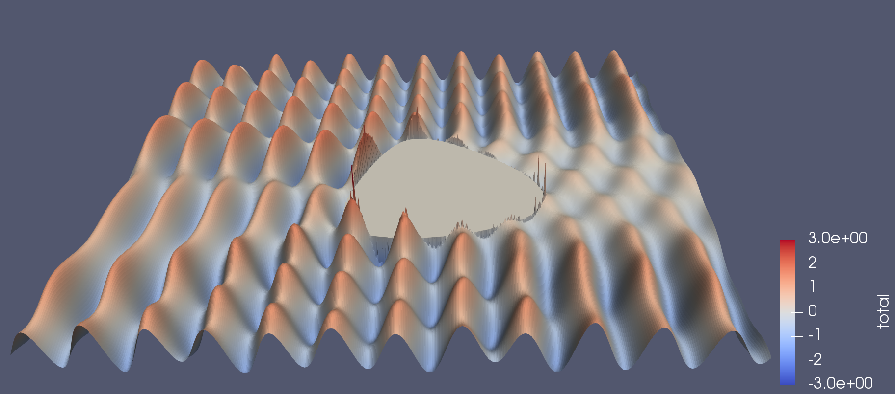

## Aim of this training

Learn how to write Python programs that run efficiently on high performance computers. At the end of this training you will:

 * be able to identify performance bottlenecks in your application
 * understand that there are many ways to write a program (but some ways are better than others)
 * know how to apply different strategies to get your code to run faster

## Prerequisites

To take this training you will need:

 * to be able to log into a Unix computer (and submit jobs if connected to a NeSI computer)
 * be comfortable with typing Unix and git commands
 * know how to use an editor
 * have some knowledge of Python and C/C++

## Getting ready


We will require Python 3 with external packages installed. On NeSI's Mahuika Cray CS400 cluster do:

```
module load Anaconda3 Boost forge
```

## Scattering wave example problem

We will run the *scatter* code, which computes the scattering of a plane wave against a two-dimensional obstacle

[](images/wave.png)

As the incoming wave moves from left to right, it encounters the obstacle,  
represented by segments, each partially reflecting and scattering the wave. 
The sum of the contributions from each segments gives the total scattered wave. 

## Checking out the code

Clone and switch to the repository:

```
git clone https://github.com/pletzer/scatter.git scatter
cd scatter
```

Under the `scatter`, you will find several implementations of the same problem. 

### How to run the scatter code

We'll start by running the original version of the code, which is entirely written in Python

```
cd original
```

To submit a job to the Slurm scheduler, type:
```
sbatch scatter.sl
```

Note: you might have to edit `scatter.sl` and add `#SBATCH --account="myAccount"` as well as other options. [See here](https://support.nesi.org.nz/hc/en-gb/articles/360000359576-Slurm-Usage-A-Primer) for more information.


### Complexity of the scatter code

At the core of the scatter algorithm are two nested loops, over the vertical `j` and horizontal `i` grid indices. For each node of the grid, the incident and scattered wave components are computed. The scattered component is the sum of the contributions from all line segments making up the obstacle contour. Hence, the complexity of the code is N^3 where N is the number of x and y grid points, and the number of segments.

```python
for j in range(ny + 1):
    y = yg[j]
    for i in range(nx + 1):
        x = xg[i]

        # need to check that x,y are outside contour
        # otherwise continue
        p = numpy.array([x, y,])

        # skip if point is inside closed contour
        if isInsideContour(p, xc, yc):
            continue

        inci[j, i] = wave.incident(kvec, p)
        scat[j, i] = wave.computeScatteredWave(kvec, xc, yc, p)
```


### How to check if the results have changed

When modifying the code, it is important to check that the results haven't changed. Use
```
python scatter.py -checksum
```
to record the sum of the field values squared (in this case 4686.33935546875).

Note: the check sum changes with resolution and other parameters, see below. 


### Adjusting the domain size and contour resolution to control the execution time

As you modify the code you will find it useful to reduce the problem size in order to quickly check that the output has not changed. Likewise you may find it useful to increase the resolution as you improve the code's performance. 

Changing the problem size can be done by passing command line options to `scatter.py`. Type `python scatter.py -h` to see the full list of options. The options that control the grid size are `-nx # -ny #` for the number of cells in the x and y direction. Option `-nc #` sets the number of segments. 

The default values are `-nx 128`, `-ny 128` and `-nc 128`.

> ## Exercises
> * what is the execution time of the default problem resolution (128x128 and 128 segments)?
> * modify the scatter.sl script to run with 64x64 and 64 segments. What is the new execution time?
> * how does the smaller problem execution time compare with the previous execution time?

