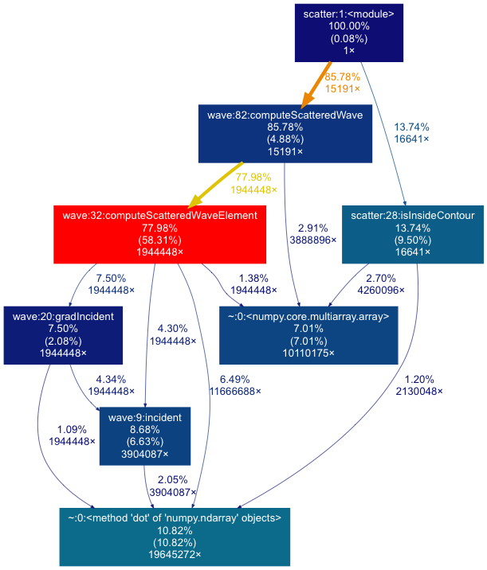

**Work in progress**

## Objectives

Learn how to profile Python code:

* use different tools to gather profiling information
* visualise the profiling data
* interpret the profiling results

## Introduction to profiling

Need to add content

* what is profiling...
* suitable cases for profiling...
* general profiling advice...


## Profiling Python code with *cProfile*

Gather profiling information and store in the file *output.pstats*:

```
python -m cProfile -o output.pstats scatter.py -nx 100 -ny 200 -ns 64 -xc "cos(2*pi*t)" -yc "sin(2*pi*t)" -lambda 0.3
```

**Note:** the code will take longer to run when profiling is enabled.

A nice way to visualise the  *output.pstats* file is with *gprof2dot*.

### Visualising the profiling output with *gprof2dot*

Install *gprof2dot*:

```
pip install --user gprof2dot
```

**TODO**: install it in the Python module.

Run `gprof2dot` to generate a PNG image file:

```
~/.local/bin/gprof2dot --colour-nodes-by-selftime -f pstats output.pstats | dot -Tpng -o output.png
```

The `dot` program comes from Graphviz, which is already installed on
Mahuika.

Now view *output.png* by copying it to your local machine or running
`display output.png` (if you enabled X11 forwarding).

It should look something like this:

[](images/scatter-profile.png)

### Interpreting the *gprof2dot* output

What does the image show:

* Each box represents a function
  - the percentage of total run time spent in this function, including time
    spent in other functions that are called by this function
  - (in brackets) the percentage of total run time spent in this function
    only, i.e. excluding time spent in other functions that are called by this
    function. We call this *self time*.
  - the number of times this function was called
* Arrows indicate which functions are called by other functions
  - information about the number of times called and percentage of total run
    time 
* We used the option `--colour-nodes-by-selftime`, so boxes are coloured by
  self time (the number in brackets)
  - red coloured boxes are the functions that have the most time spent in them
  - blue boxes have the least time
* Some functions that take a very low percentage of total run time may not
  show up

What to look for:

* Typically you would look for functions that have a lot of *self* time (the
  number in brackets). We call these functions *hotspots*.
  - 38.94% of total time is spent in `computeScatteredWaveElement` (the red
    box), so this would be a good place to start when trying to optimise this
    code.
* Sometimes functions show up from libraries that you call (e.g. *scipy* or
  *numpy*), for example the green box calling `cross` that takes 21.19% total
  time.
  - Usually you don't want to change code from external libraries, but you can
    look at your functions that call that function, by going back along the
    arrow. You might be able to optimise the way your code calls the external
    function, or remove the call entirely.


## Profiling Python code with *line_profiler*

The *cProfile* tool only times function calls. This is a good first step to
find hotspots in your code (and often this is enough by itself). However, in
some cases knowing that a particular function takes a lot of time is not
particularly helpful. For example, it could be a very long function.

With *line_profiler* you have to explicitly tell it which functions you would
like to be profiled, by modifying the source code slightly. Then
*line_profiler* will time the execution of individual lines within those
functions.

**Note:** *line_profiler* is installed in the Python module we loaded earlier.
You can check it is installed by running `kernprof --help`, which should print
help information for the `kernprof` (*line_profiler*) program that we are going
to use.

To demonstrate the use of *line_profiler* we will use it to profile the
`isInsideContour` function.

**Note:** we chose this function because it is short, which means we can
include the output here and explain it. Typically, you would use
*line_profiler* to gather more information about functions that *cProfile* has
identified as hotspots.

1. Edit the file *scatter.py*. Find the line that starts with:
   ```
   def isInsideContour(p, xc, yc):
   ```
   On the previous line add `@profile`, which is known as a *decorator* and
   tells *line_profiler* that we want to profile this function:
   ```
   @profile
   def isInsideContour(p, xc, yc):
   ```
2. Run *line_profiler*:
   ```
   kernprof -l -v scatter.py -nx 100 -ny 200 -ns 64 -xc "cos(2*pi*t)" -yc "sin(2*pi*t)" -lambda 0.3
   ```
   The `-l` flag tells *line_profiler* to do line-by-line profiling and `-v`
   tells it to print the profiling information out at the end of the run.

Detailed documentation about *line_profiler* can be found
[here](https://github.com/rkern/line_profiler).

### Interpreting *line_profiler* output

You should see something like this after *line_profiler* has run:

```
Wrote profile results to scatter.py.lprof
Timer unit: 1e-06 s

Total time: 14.9237 s
File: scatter.py
Function: isInsideContour at line 26

Line #      Hits         Time  Per Hit   % Time  Line Contents
==============================================================
    26                                           @profile
    27                                           def isInsideContour(p, xc, yc):
    28     20301        24264      1.2      0.2  	tot = 0.0
    29   1319565       930299      0.7      6.2  	for i0 in range(len(xc) - 1):
    30   1299264       889747      0.7      6.0  		i1 = i0 + 1
    31   1299264      4746461      3.7     31.8  		a = numpy.array([xc[i0], yc[i0]]) - p[:2]
    32   1299264      4402325      3.4     29.5  		b = numpy.array([xc[i1], yc[i1]]) - p[:2]
    33   1299264      3889319      3.0     26.1  		tot += math.atan2(a[0]*b[1] - a[1]*b[0], a.dot(b))
    34     20301        17385      0.9      0.1  	tot /= twoPi
    35     20301        23947      1.2      0.2  	return (abs(tot) > 0.1)
```

* Line numbers and the contents of each line are shown
* The "% Time" column is useful; it shows the percentage of time in that
  function that was spent on that line
* "Hits" shows the number of times that line was run
* We can see that lines 31, 32 and 33 each take around 30% of the time spent
  in this function.

## Do we want a section on memory_profiler too?

## Summary

Need to add content

