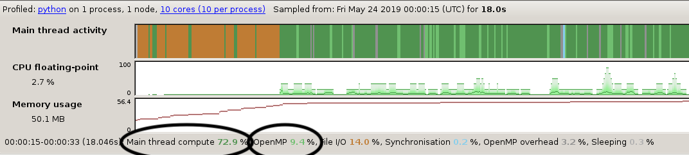
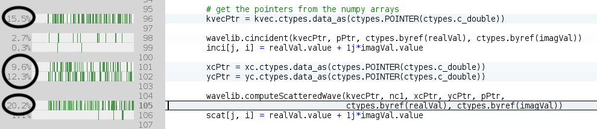

## Objectives

You will:

* learn how to use MAP to profile an OpenMP code
* learn how to interpret MAP multithreaded profiling data


## Code example

We'll use the *scatter.py* code in directory `mpi` of the *solutions* branch. Start by

```
git fetch --all
git checkout solutions
cd openmp
```

## Using MAP to profile an OpenMP executable

To use MAP we need to load the *forge* module in our batch script and insert `map --profile` between `srun` and the executable. See for example
```
ml forge
srun map --profile python scatter.py
```
in the Slurm script "scatter.sl".

**Note:** command `map --profile` must *follow* `srun` in the case of a serial/threaded program. (For MPI programs `map --profile` should *precede* `srun`.)

> ## Exercises
>
> * edit script `scatter.sl`:
    * apply 8 OpenMP threads
    * load module `forge`
    * add command `map --profile` to the executable
> * submit the job

## Interpreting the profiling information

Upon execution, a file with subscript *.map* will be generated. The results can be viewed with the command *map*,
```
map python_scatter_py_1p_1n_8t_2019-05-24_00-00.map
```
(the *.map* file name will vary with each run.)

Below is an example of a profiling data obtained by running `python scatter.py -nx 256 -ny 256` and using 8 OpenMP threads.

[](images/map_8t_trace.png)
On top, the activity window shows the time spent between I/O (orange), serial computing (dark green) and parallel computing (light green). The orange parts amount to initialisation, an one off cost that does not increase with problem size and which is therefore not of great interest here. (Loading shared libraries such as `numpy` are responsible for the orange I/O activity.)

More interestingly, we see that 73 percent of the time is spent in the serial part of the code and 9 percent in the parallel part. The parallel part is the one that decreases as we throw more threads to the problem. This suggests that we are close to achieving the maximum scalability of the program with 8 threads - adding more threads can only reduce the execution time by 9 percent at most.

Also of interest, we observe that more than 50 percent of the execution time involves four lines of code (96, 101, 102 and 105). Lines 96, 101 and 102 all are purely serial and involve casting a numpy array into a C pointer which can be passed to a C function. Together these lines consume 36 percent of the execution time.
[](images/map_8t_percents.png)


> ## Exercises
> * edit scatter.py:
    * remove lines 101 and 102 (which are superfluous)
    * move line 96 out of the loop (*kvec* is constant)
> * regenerate the profiling data and compare the newly obtained profiling data with the previously obtained data
    * how did the contributions of parallel and serial execution times relative to the total time change?
    * how did the the contribution of function `computeScatterWave` to the total execution time change?

