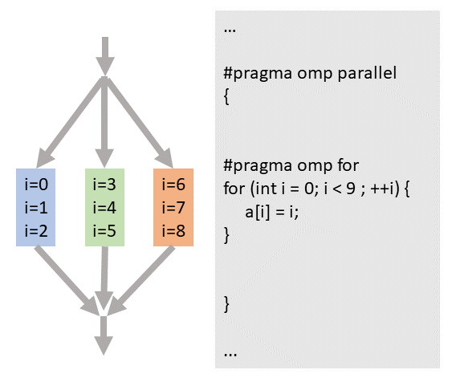

## Objectives

You will:

* learn what threads are 
* learn how to leverage OpenMP to accelerate your C/C++ code 
* learn to compile C/C++ code with OpenMP enabled using `setuptools`

We will use the code in directory `openmp`. Start by
```
cd openmp
```

## Why implement OpenMP parallelisation

Most modern computers have multi-core CPUs. All cores of a CPU can access the same, shared memory. Furthermore, all the CPUs belonging to a node also share the same memory. Given that there are 36 cores and each core can execute two threads or work loads, up to 72 instructions can potentially be executed simulateneously with OpenMP on Mahuika.

## What is OpenMP

OpenMP (Open Multi-Processing) is an application programming interface (API) for shared memory multiprocessing programming in C, C++ and Fortran.  An OpenMP-parallelised application starts as a serial application that runs on a single compute core. When instructed by the programmer, the application spawns a number of threads, which can run concurrently on separate cores. Thus, work can be distributed to leverage more resources.

Note that the OpenMP standard was recently extended to enable offloading computations to GPUs and other accelerators. However, not all compilers support this feature yet and there is a similar, competing standard called OpenACC that addresses the same use case. We will limit this lesson to multicore computing without offloading.

### Pros

* supported by a large range of shared memory multicore architectures (virtually all modern CPUs have several cores) and accelerators
* the same source can be used to compile OpenMP and non-OpenMP code
* can be easier to implement than MPI parallelisation - a few lines of code may yield significant speedups
* can be more efficient than MPI as data in memory can be shared between multiple threads

### Cons

* limited to the resources of a single compute node
* it is possible to create "race conditions" where multiple threads overwrite each other's work and such errors can be difficult to debug
* beware of external functions that are not "thread-safe" as these functions are susceptible to race conditions

## How to use OpenMP

To use OpenMP we need to
* tell the compiler to spawn threads by adding directives to the code, specifying where and what to parallelise
* set the number of threads to be used at run time

### Compiler switches

Use the following compiler switches:
* GNU: `-fopenmp`
* Intel: `-qopenmp`
* Cray: OpenMP is enabled by default, use `-h noomp` to disable OpenMP

### Directives

Parallelisation with OpenMP is implemented using directives, which are written as pragmas (C/C++) or specially formatted comments (Fortran). OpenMP also provides an additional Application Program Interface (API) that allows the program to configure and query the run time environment, e.g., to find out how many threads are running in parallel and which thread ID is running a given parallel section. For more information, have a look at the latest [OpenMP standard](https://www.openmp.org/wp-content/uploads/openmp-4.5.pdf).

OpenMP directives in the source code are interpreted by the compiler. The same source code can be used to build a serial or threaded version of the application by simply turning the OpenMP compiler switch on or off, and a non-OpenMP compiler will ignore the directives as unknown pragmas (C/C++) or as comments (Fortran).

OpenMP directives always start with:
* C/C++: `#pragma omp`
* Fortran (free form): `!$omp`

Directives are followed by the _directive names_ and _clauses_, controlling parallelisation and data handling. OpenMP directives can consist of multiple statements and can be extended to multiple lines using line continuation characters such as `&` (Fortran) or `\` (C/C++) at the end of the line.

There are various ways to distribute workloads for parallel execution, the most common being the parallel loop represented below:

[](images/example_omp_threads.png)

The application always starts in serial mode on a single thread (single arrow at the top). When requested, multiple threads are created/spawned (multiple arrows at the top). In this particular case, the number of threads is 3 (coloured boxes), and each thread performs three iterations (9 iterations altogether). Results are stored in separate elements of array `a` for each loop index `i`, so we do not create a race condition when the loop is executed in parallel. The program then resumes running on a single thread (single arrow at the bottom).

### Data handling
Because OpenMP is based on the shared memory programming model, most variables are shared by default. Other variables like loop index are meant to be private, i.e. the variable can take a different value for each thread. The programmer determines which variables are private and which are shared.

### Example
As an example, we’ll assume that you have to compute the sum of the square of each element of an array:
```cpp
/**
 * Compute the sum of the square of array elements
 * @param n number of elements
 * @param arr input array
 * @return res
 */
extern "C"
double mySumSq(int n, double* arr) {
    double res = 0;
    #pragma omp parallel for default(none) shared(arr,n) reduction(+:res)
    for (int i = 0; i < n; ++i) {
        // all variables defined inside the loop (including i) are private
        res += arr[i] * arr[i];
    }
    return res;
}
```

With the `parallel` statement we ask the compiler to spawn threads. The number of threads can be set *during run time* using the environment variable `OMP_NUM_THREADS`, which can be anything between 1 and the number of cores on a node, e.g., `export OMP_NUM_THREADS=8`. 

Note, most applications do not scale to the maximum number of cores on a node due to non-uniform memory bandwidth, lack of load balancing between tasks and Amdahl's law. The latter states that the maximum speedup is limited by the ratio of parallel to serial parts of the code. As a rule of thumb, if 5 percent of the time is spent in a part of the code that cannot be parallelised (that is a critical section or serial part) then the maximum parallel speedup is about 20 (or 1/0.05). There would be little point in using more than 20 threads in this case.

The `for` construct specifies that we want to parallelise the `for` loop that immediately follows the pragma. The different iterations of the loop will be then handled by different threads.

It is good practice to always use the `default(none)` clause, which forces us to declare the `shared` or `private` status of each variable defined _above_ the parallel region. Variables that are defined _inside_ the parallel region, such as loop index variable `i`, are automatically private.

It is generally good practice to define local variables inside the loop where possible. This will make your program easier to read and maintain and you won't have to worry about creating race conditions by erroneously sharing a variable between threads. If you still need to declare, e.g., `myvariable` outside the loop, add the clause `private(myvariable)` to the OpenMP pragma.

Loop trip count `n` and data arrays `arr` can be shared as they are not changed inside the loop. Each thread will access the same data in memory, which is very efficient.

Variable `res` is special - it has to store the sum across all loop iterations at the end of the loop, even though individual iterations are executed by different threads. So `res` needs to be private to each thread at first and store partial sums. These partial sums then need to be collected by the original thread at the end of the loop to compute a grand total, which will be stored in `res` on that thread. The `reduction(+:res)` clause makes sure that the compiler will insert all required code to accomplish this.

> ## Exercises

> * record the execution time for 8 threads
> * add an OpenMP pragma at line indicated by `// ADD OPENMP PRAGMA HERE` in `src/wave.cpp` (assume function `computeScatteredWaveElement` to be thread-safe)
> * re-run the code and report the new execution time
