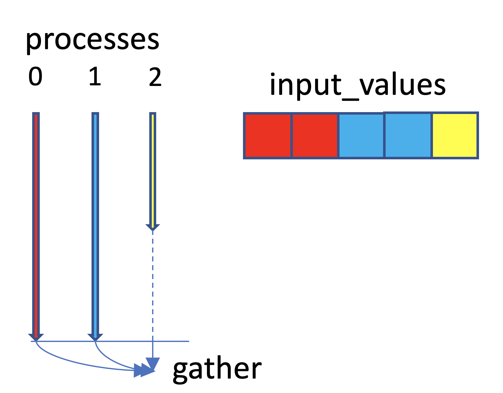

## Objectives

You will:

* learn how to parallelise code using the message passing interface (MPI)

## What is MPI

MPI is a standard application programming interface for executing programs in parallel. MPI was originally written for C, C++ and Fortran code but implementations have since been written for a variety of other languages, including Python.

MPI programs start a number of processes at the beginning of the program. A process is an instance of an executable that runs concurrently with other processes.

As the process runs, the program may need to exchange data with other processes. An example of data exchanges is point-to-point communication where a process sends data to another process. In other cases data may be "gathered" from processes and sent to a root process. Inversely, data can be scattered from the root process to other processes.

### Pros

 * suitable for distributed memory computers, including massively parallel architectures with thousands of cores
 * a viable approach if you don't have enough memory on a node
 * can be used in combination with OpenMP and other parallelisation methods

### Cons

 * there are no serial sections in MPI code and hence MPI programs tend to be written to run in parallel from the beginning to the end

## An example of MPI work load distribution

Say we need to compute the elements of a 4x5 array, shown below on the right, and the computation of each matrix element is very costly. We have 7 processes available for this task, shown on the left. 

In order to reduce the execution time of the program, we may decide to distribute the work between processes. Each (colour coded) process will compute a few elements in the matrix. For instance, process 0 (red) will compute the first three elements, process 1 (yellow) the next three elements, etc. until process 6 (grey) which will be computing the remaining two elements. Once the elements of the matrix are computed, a gather operation collects the elements into a single array on process 6 - this is shown as converging arrows. 

Neglecting the time it takes to gather the elements, we can expect the execution time to be reduced from 20 (number of matrix elements) to 3 time units (maximum number of elements handled by a process). We get a speedup of 6.7x in this case. The ideal speedup is 7x but this cannot happen because process 6 has to wait until processes 0-5 finish. This is known as a *load balancing* problem, that is processes may take different amounts of time to a complete a parallel task, causing some processes to stall (dashed line). Naturally, we should always strive to assign the same amount of work to each process.   

Transferring data from processes 0-5 to 6 takes additional time. Hence 6.7x would be the maximum, achievable speedup for this case assuming that the work to compute each matrix element is the same.


[](images/example-mpi-gather.png)


## Running the scatter code using multiple MPI processes
We'll use the code in directory `mpi`. Start by
```
cd mpi
```

### On Mahuika

Type
```
srun --ntasks=4 python scatter.py
```
(with additional `srun` options such as `--account=` required). This will request 4 processes.  

### Interactive parallel execution 

To run interactively using 4 processes, type
```
mpiexec -n 4 python scatter.py
```

## How to use MPI to accelerate `scatter.py`

 * At the top: `from mpi4py import MPI`. This will initialise MPI. The number of processes is `nprocs`.
 * Assign a collection of scattered field elements to each MPI process. The process dependent start/end indices into the flat array are `indxBeg` and `indxEnd`. Compute the scattered field for indices `indxBeg` to `indxEnd - 1`.
 * Gather the fields from each process onto root process `nprocs - 1`, see [mpi4py](https://info.gwdg.de/~ceulig/docs-dev/doku.php?id=en:services:application_services:high_performance_computing:mpi4py) documentation.

## Exercises

 1. Implement the field computation in scatter.py after line `IMPLEMENT FIELD COMPUTATION HERE`.

 2. Implement the field gather operation where all the fields values are assembled onto the root process. This is required for the checksum and save operations to work.

 3. Measure the speedup compared to a single process execution
