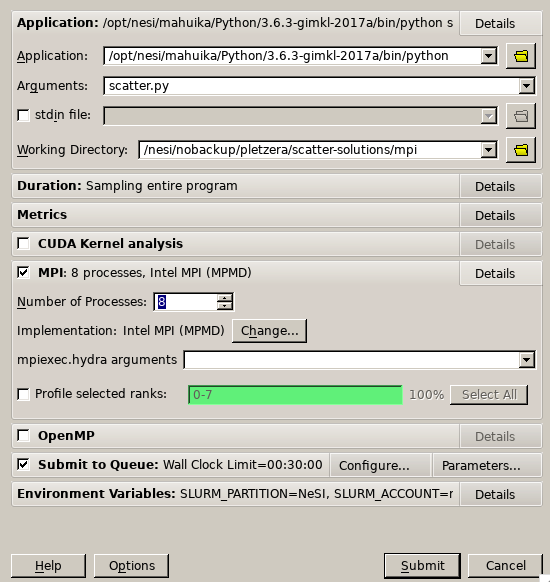

## Objectives

Learn how to profile parallel codes using ARM MAP:

* learn how to use MAP
* visualise the profiling data
* interpret the profiling results

## Introduction to profiling parallel codes

Parallel profiling tools provide information about how much time is spent in different parts of your code by different threads/processes.
There are 2 major ways to collect profiling data: *sampling* and *tracing*. Sampling is a statistical method. During run time the so called *stack trace* is analysed regularly. In contast to that tracing measures actual run time of instrumented parts with a well defined start and end. The data from all threads/processes are gathered and analysed. Thus we can not only see which part of the code is most time consuming, but also how this performs on different processes.

Due to possible overhead (especially for tracing experiments) the program could run significantly slower than normal. Therefore it is generally advisable to first run a sampling experiment and choose a small representative test case to profile.

## Profiling test case

The profiling case should be:
* representative, need to cover all features used during production
* short in run time for fast turnaround, but long enough with sufficiently many data points (usually few minutes)
* scaling effects can be investigated by comparing profiles small and big jobs

**Note:** keep in mind, that with shortened computation time, the initialisation and finalisation becomes more dominant.


## ARM MAP profiler

On NeSI systems the [ARM MAP](https://www.arm.com/products/development-tools/server-and-hpc/forge/map) profiler is provided as part of the `forge` module (along with the parallel debugger, DDT).

MAP is a commercial product, which can profile parallel, multi-threaded and single-threaded C/C++, Fortran and F90, as well as Python codes. It can be used without code modification.
MAP can be launched with a GUI and without. The GUI allows the user to navigate thru the code and enables to focus on specific source lines. The "Express Launch", without GIU enables easy usage of existing queue scripts and workflows.

For more details see [ARM MAP documentation](https://developer.arm.com/docs/101136/latest/map).

In the following both, GUI and express launch are used with the scatter example.

## Scatter MPI test case

We'll use the code in directory `mpi`. Start by

```
cd mpi
```

The MPI version of scatter performs the default test case within short time (less than 20 seconds). We could argue that this could be to short. Thus, we increase the problem size:
```
python scatter.py -c -nx 256 -ny 256 -nc 256
```
## using the "Express Launch"

To use ARM MAP we need to load `module load forge` in our batch script and add `map --profile` in front of the parallel run statements. Thus, `srun`, its options as well as our executable and its arguments are passed to MAP.
Thus in the script we will have something like:

```
module load forge
map --profile srun python scatter.py -c
```

As a result some general information about the program run is printed to stdout from MAP as well as a file with the profiling information. This has the file ending `.map`. The results can be view by launching map with that file (see section [MAP Profile](#map-profile) ).

## using the graphical Interface

The GUI can be started after loading `module load forge` and launching `map`.
[](images/ARM_MAP_main.png)
In the profile menu we need to specify the executable (in this case `python`), the arguments (here `scatter.py -c`) and a working directory. Additional to that, we need to define the parallelisation parameters, e.g. one MPI process and 8 OMP threads.
[](images/ARM_MAP_run.png)

Furthermore, the "submit to queue" parameter need to be checked, for example the `--hint=nomultithreading` can be specified there.

After submitting, MAP will wait until the job is allocated, connect to the processes, run the program and gather all the data. Then the profile information will be presented.

## MAP Profile

The profile window is divided into three main sections.
[](images/ARM_MAP_scatter_mpi.png)
On top various metrics can be displayed, which can be switched in the "Metrics" menu.
In the middle part, a source code navigator connects line by line with profiling data.
Most interesting for us here, is the profiling table on the bottom. Presenting the most time consuming parts of the program with function names, the actual source code, and its location.
For more detail, the table can be extended with the most time consuming parts of the contained sub-function calls.

The Metrics part can be changed to:
* Activity timeline
* CPU instructions
* CPU Time
* IO
* Memory
* MPI

As an example, "CPU instructions" present the usage of different instruction sets during the program run time.
[](images/ARM_MAP_scatter_mpi_CPU.png)


## Summary

You should now be able to profile parallel programs using MAP to help understand where time is being and where we should start to optimise.
